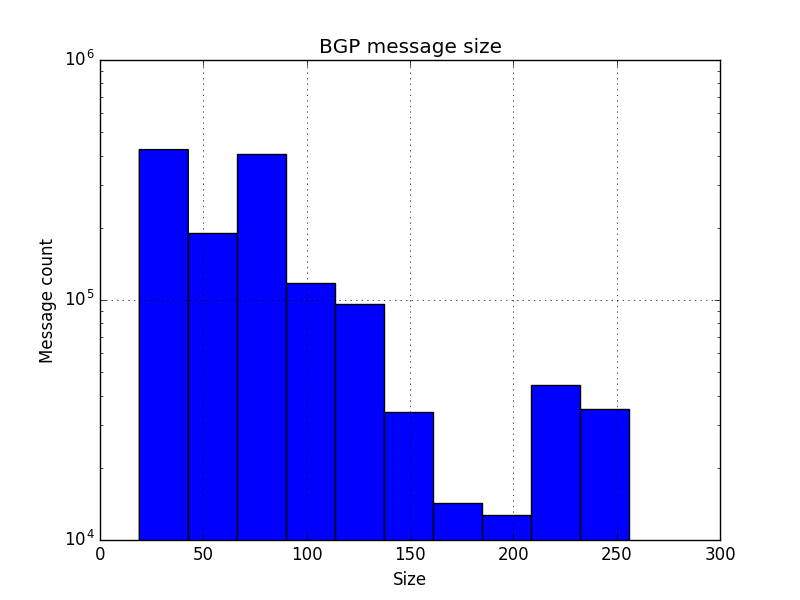

# Example: Plot BGP message size
This is a basic example how to integrate _pbgpp_ into a toolchain to plot the distribution of BGP message sizes.

## Preparations
We want to collect the plot data from a PCAP file. We are only interested in one single value (the message size in bytes) and furthermore we want to use another script to get rid of the plotting. Therefore we are using line based output because it's easy to handle within our plotting script. And we just need to display a single field, because we don't need any other information out of the BGP messages.

`cat dump.pcap | pbgpp -f LINE --fields length -`

This easy command will use the PCAP file `dump.pcap` as input file and will output the message length (= size in bytes) only. Therefore there is no need to split out any kind of fields in our plotting script.

## Plotting script
We are expecting our data to plot from standard in. The script will use _matplotlib.pyplot_ to create the final image.

```python
import matplotlib.pyplot as plt    
import sys

# Empty variable for our incoming data
data = []

# Get data from stdin until EOF
for line in sys.stdin:
    try:
        # Try to convert incoming data into an integer value
        int_data = int(line)
        
        # Add the value to our dataset
        data.append(int_data)
    except Exception:
        # We could do some error handling here
        pass

# Create a histogram of the data
plt.hist(data)

# Set title and axis settings
plt.title("BGP message size")
plt.xlabel("Size")
plt.ylabel("Message count")
plt.yscale("log")
plt.grid(True)

# Plot!
plt.show()
```

## Running the example
Now we can combine _pbgpp_ and our plotting script to collect the data and visualize it.

`cat dump.pcap | pbgpp -f LINE --fields length - | python plot.py`

## Output
Let's have a look on the result!


